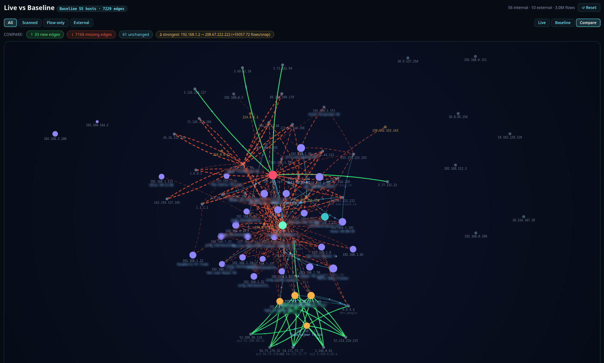
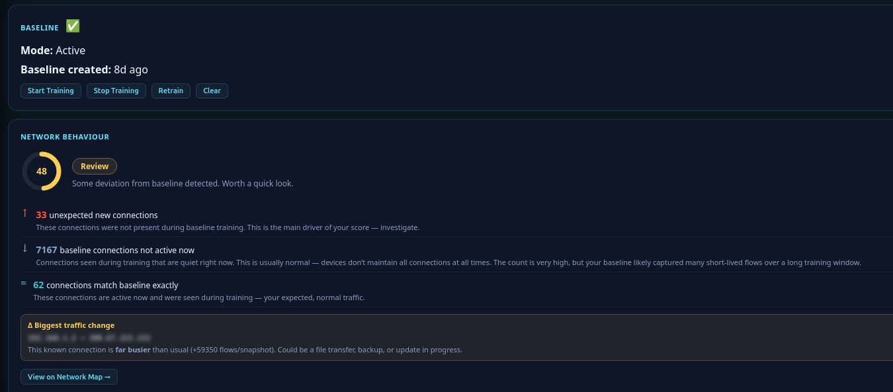
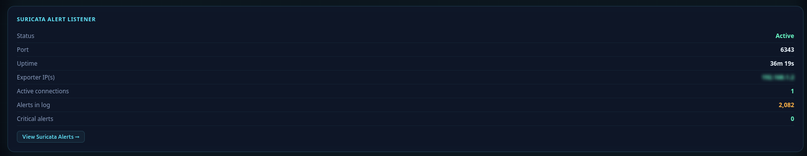
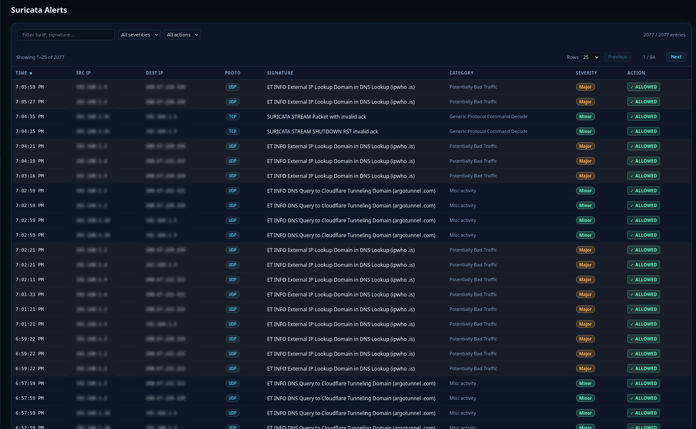
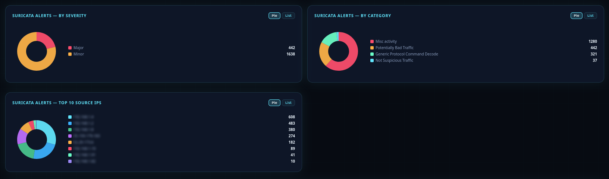

Security Assistant

Security Assistant est une integration personnalisee Home Assistant pour la
surveillance de securite du reseau domestique. Elle combine l'analyse passive
du trafic NetFlow/IPFIX, le scan actif des hotes, la verification DNS via
listes de menace, l'enrichissement des IP externes et la visibilite CVE dans
un tableau de bord lateral unique.

Site web
- https://domotic.monster/homesec.html

Depot GitHub
- https://github.com/domo-monster/HomeSecurityAssistant

Documentation par langue
- Anglais : https://domotic.monster/homesec.html
- Francais : https://domotic.monster/homesec_fr.html
- Allemand : https://domotic.monster/homesec_de.html

Version
- 0.9.0

Fonctionnalites principales
- Ecoute NetFlow v5/v9/IPFIX avec classification trafic interne/externe.
- Scanner actif (optionnel) : disponibilite des hotes, ports ouverts,
  services detectes, empreintes legeres.
- Renseignement IP externe via ipwho.is (par defaut), VirusTotal et AbuseIPDB
  en option.
- Fonctionnalites DNS proxy + blacklist avec journalisation des requetes.
- Visibilite vulnerabilites avec NVD et correlation CISA KEV.
- Findings, recommandations et detection d'anomalies via baseline.
- Panneau frontend multi-vues : Overview, Network Map, Hosts, Findings,
  External IPs, Vulnerabilities, Statistics, DNS, Suricata,
  Recommendations, Settings.

Nouveautes 0.9.0
- Application des options en place (moins de rechargements complets perturbants).
- Enregistrement des parametres en mode non bloquant.
- Journaux de timing demarrage/rechargement pour profiler les lenteurs.
- Carte de liens en bas de la page Settings (GitHub + documentation selon langue).
- Lien copyright lateral mis a jour vers https://domotic.monster.

Visuels du baseline
- Comparaison Live vs Baseline :

  

  

Suricata - Flux des alertes
- **Ecouteur d'alertes Suricata EVE** - Home Security Assistant peut recevoir les alertes Suricata via TCP et les integrer au tableau de bord lateral ainsi qu'au journal d'alertes.
- **Script d'envoi accompagne** - le script `suricata_pusher.py` fourni lit en continu le fichier JSON EVE de Suricata et envoie chaque ligne d'alerte au listener.
- **Visibilite des alertes** - les alertes Suricata apparaissent dans le tableau de bord lateral et sont conservees avec les autres journaux d'execution apres redemarrage.

Visuels Suricata
- Vue d'ensemble :

  

- Liste d'alertes :

  

- Statistiques :

  

Installation (HACS)
1. Ouvrir HACS -> Integrations -> Custom Repositories.
2. Ajouter : https://github.com/domo-monster/HomeSecurityAssistant
3. Installer Security Assistant.
4. Redemarrer Home Assistant.
5. Ajouter l'integration dans Settings -> Devices & Services.

Installation manuelle
1. Copier custom_components/homesec dans custom_components de Home Assistant.
2. Redemarrer Home Assistant.
3. Ajouter l'integration dans Settings -> Devices & Services.

Services principaux
- homesec.trigger_scan
- homesec.nvd_refresh
- homesec.blacklist_refresh
- homesec.start_baseline_training
- homesec.stop_baseline_training
- homesec.retrain_baseline
- homesec.clear_baseline

Notes importantes
- L'analyse de flux repose sur des metadonnees (pas inspection complete du payload).
- Les empreintes et roles sont heuristiques.
- La qualite d'enrichissement externe depend des cles API optionnelles.

Fichiers persistants
L'integration stocke etat et configuration en YAML dans /config, notamment
homesec.yaml, homesec_hosts.yaml, homesec_dns_log.yaml, homesec_ext_ips.yaml,
homesec_baseline.yaml et fichiers associes.

Historique des versions
- Voir changelog.txt dans ce depot.